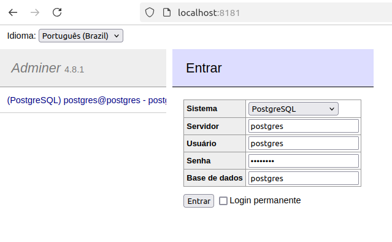

# Gerenciamento de Usuários - Backend

Link para o video explicativo da aplicação:
https://www.icloud.com/iclouddrive/0e0xGFjc42cmUUrHd9MaGQG_g#VideoFiap

## Introdução

Este projeto faz parte de um desafio técnico para desenvolver um sistema de gerenciamento de usuários para um grupo de
restaurantes.
O objetivo é criar uma solução backend robusta que permita operações de criação, atualização, exclusão e validação de
login de usuários, suportando dois tipos de usuários: Dono de Restaurante e Cliente.

## Objetivo do Projeto

O principal objetivo deste projeto é melhorar a eficiência operacional dos restaurantes, permitindo que eles gerenciem
seus usuários de forma centralizada. Além disso, o sistema visa facilitar a interação dos clientes com os
estabelecimentos, oferecendo uma plataforma onde eles podem se cadastrar, acessar informações e realizar operações de
forma segura e eficiente.

## Requisitos do Sistema

Para executar este projeto, você precisará dos seguintes requisitos de sistema:

- **Sistema Operacional**: Windows, macOS ou Linux
- **Memória RAM**: Pelo menos 4 GB recomendados
- **Espaço em Disco**: Pelo menos 500 MB de espaço livre
- **Software**:
    - Docker e Docker Compose
    - Java JDK 11 ou superior
    - Maven 3.6 ou superior

## Estrutura do Projeto

A estrutura do projeto é organizada da seguinte forma:
```plaintext
projeto-fiap-v4/
│
├── src/
│ └── main/
│   ├── java/
│   │ └── com.fiap.gestao.restaurante
│   │   ├── controller/ : Camada de controle que expõe APIs REST.
│   │   ├── model/ : Representação de objetos do banco de dados.
│   │   ├── service/ : Lógica de negócios da aplicação.
│   │   ├── repository/ : Interação com o banco de dados
│   │   ├── config/ : Configurações de segurança e swagger
│   │   ├── exception/ : Exceções personalizadas
│   │   ├── mapper/ : Mapeamento entre camadas
│   │   ├── dto/ : Objetos de transferência de dados
│   │   ├── enums/ : Enumerado para auxiliar regras
│   │   └── specifications/ : Specifications para filtro no banco de dados
│   └── resources/
├── pom.xml
├── README.md
├── Dockefile
├── docker-compose.yml
├── postman-collections/
└── ...
```

## Segurança

A segurança do sistema é tratada com o uso do Spring Security, que fornece autenticação e autorização robustas. As
principais medidas de segurança implementadas incluem:

- **Autenticação**: Os usuários devem fornecer credenciais válidas (login e senha) para acessar o sistema. As senhas são
  armazenadas de forma segura usando hashing.
- **Proteção contra Ataques Comuns**: O sistema é configurado para proteger contra ataques comuns, como CSRF (Cross-Site
  Request Forgery) e XSS (Cross-Site Scripting), através de cabeçalhos de segurança e validação de entrada.

## Visão Geral do Projeto

Este projeto é um backend desenvolvido com o framework Spring Boot, utilizando PostgreSQL como banco de dados.
O sistema é projetado para gerenciar usuários, permitindo operações de criação, atualização, exclusão e validação de
login. O sistema suporta dois tipos de usuários: **PROPRIETARIO** e **CLIENTE**.

## Arquitetura

A arquitetura do projeto segue o padrão MVC (Model-View-Controller) e é organizada em pacotes que separam as
responsabilidades:

- **Model**: Contém as classes que representam as entidades do sistema, como `User`, `Login`, e
  `Endereco`. Essas classes definem a estrutura dos dados que serão manipulados pela aplicação.

- **Controller**: Contém as classes que gerenciam as requisições HTTP e interagem com os serviços, como
  `UserController`. Os controladores são responsáveis por receber as solicitações do cliente, processá-las e retornar as
  respostas apropriadas.

- **Service**: Contém a lógica de negócios, como `UserService`, que manipula as operações relacionadas aos usuários.
  Essa camada é responsável por implementar as regras de negócio e orquestrar as interações entre os repositórios e os
  controladores.

- **Repository**: Contém as interfaces que abstraem a lógica de acesso a dados, como `UserRepository`. Os repositórios
  são responsáveis por realizar operações de CRUD (Create, Read, Update, Delete) nas entidades.

- **Mapper**: Utiliza o MapStruct para converter entre entidades e DTOs (Data Transfer Objects), facilitando a
  transferência de dados entre camadas. Isso ajuda a desacoplar a representação interna das entidades da API.

- **Exception**: Contém classes para tratamento de exceções personalizadas. Essa camada é responsável por capturar e
  gerenciar erros que podem ocorrer durante a execução da aplicação.

- **Security**: Contém configurações e classes relacionadas à segurança da aplicação, como autenticação e autorização.
  Isso pode incluir a configuração do Spring Security para proteger endpoints e gerenciar usuários.

- **Swagger**: Configurações para a documentação da API usando Swagger/OpenAPI. Isso permite que os desenvolvedores
  visualizem e testem os endpoints da API de forma interativa.

- **Request**: Contém classes que representam as solicitações feitas à API, como `UserRequest`. Essas classes são usadas
  para validar e transferir dados de entrada.

- **Response**: Contém classes que representam as respostas da API, como `ApiResponse`. Essas classes são usadas para
  padronizar a saída da API e fornecer informações sobre o resultado das operações.
  

## Princípios de Design e Padrões de Projeto

### Princípios de Design

1. **Single Responsibility Principle (SRP)**:
    - Cada classe tem uma única responsabilidade. Por exemplo, a classe `UserService` é responsável apenas pela lógica
      de negócios relacionada aos usuários, enquanto o `UserController` lida com as requisições HTTP.

2. **Open/Closed Principle (OCP)**:
    - As classes estão abertas para extensão, mas fechadas para modificação. Por exemplo, você pode adicionar novos
      métodos ao `UserService` ou criar novos controladores sem modificar as classes existentes.

3. **Liskov Substitution Principle (LSP)**:
    - Embora não haja herança explícita, o uso de interfaces como mappers e repositories permitem que a injeção de dependencias seja feita a partir da interface ao invés da implementação.

4. **Interface Segregation Principle (ISP)**:
    - O código não apresenta interfaces grandes e complexas. Em vez disso, as classes são projetadas para implementar
      apenas os métodos que realmente precisam.

5. **Dependency Inversion Principle (DIP)**:
    - O código depende de abstrações (interfaces) em vez de implementações concretas. Por exemplo, o `UserService`
      depende do `UserRepository`, que é uma interface, permitindo que você altere a implementação sem afetar o serviço.

### Padrões de Projeto

1. **MVC (Model-View-Controller)**:
    - A estrutura segue o padrão MVC, onde:
        - **Model**: Representado pelas classes de modelo (`User`, `Endereco`, etc.).
        - **Controller**: As classes de controlador (`UserController`) gerenciam as requisições e interagem com os
          serviços.
        - **View**: Embora não exista uma camada de visualização tradicional, as respostas JSON podem ser vistas como
          uma forma de "view".

2. **Repository Pattern**:
    - O uso do `UserRepository` para abstrair a lógica de acesso a dados é um exemplo clássico desse padrão. Ele permite
      que a lógica de persistência seja separada da lógica de negócios.

3. **Service Layer Pattern**:
    - A classe `UserService` encapsula a lógica de negócios, separando-a da lógica de controle. Isso facilita a
      manutenção e a testabilidade.

4. **Data Transfer Object (DTO)**:
    - O uso de classes como `UserRequest` e `UserResponse` para transferir dados entre camadas é uma boa prática que
      ajuda a desacoplar as representações internas das entidades da API.

5. **Mapper Pattern**:
    - O uso do MapStruct para conversão entre entidades e DTOs é uma implementação do padrão Mapper, que ajuda a manter
      a separação entre as diferentes representações de dados.

6. **Exception Handling Pattern**:
    - O tratamento de exceções usando `@ControllerAdvice` é uma abordagem comum para centralizar o gerenciamento de
      erros em aplicações Spring.

## Interação entre as Partes do Sistema

1. **Requisição do Cliente**: O cliente faz uma requisição HTTP para um endpoint específico (por exemplo,
   `/users/login`).
2. **Controller**: O `UserController` recebe a requisição e chama o método apropriado no `UserService`.
3. **Service**: O `UserService` executa a lógica de negócios necessária, como validar o login ou atualizar os dados do
   usuário.
4. **Repository**: O `UserService` interage com o `UserRepository` para realizar operações no banco de dados.
5. **Resposta ao Cliente**: Após processar a requisição, o `UserController` retorna uma resposta ao cliente, que pode
   incluir dados ou mensagens de erro.

## Tecnologias Utilizadas

- **Spring Boot**: Framework para desenvolvimento de aplicações Java.
- **PostgreSQL**: Sistema de gerenciamento de banco de dados relacional.
- **MapStruct**: Biblioteca para mapeamento de objetos.
- **Lombok**: Biblioteca para reduzir o boilerplate de código em classes Java.

### Pré-requisitos

Antes de executar o projeto, certifique-se de ter as seguintes ferramentas instaladas:

- **Docker**
- **Docker Compose**
- **Java JDK 11 ou superior**
- **Maven 3.6 ou superior**
- **GIT**

## Como Executar o Projeto

1. Clone o repositório:
   git clone https://github.com/amouraorr/projeto-fiap-v4.git
   
   *obs: utilizar a branch 'main'

### Passos para Criar o Pacote do Projeto

1. No terminal navegue até o diretório do projeto
2. Executar o comando do Maven para compilar e empacotar o projeto
```plaintext
 mvn clean package -DskipTests
```

### Passos para Executar o Docker Compose

1. Certifique-se de que o Docker e o Docker Compose estejam instalados e rodando na sua máquina.
2. No terminal navegue até o diretório onde está localizado o arquivo docker-compose.yml.
3. Execute o seguinte comando para iniciar os contêineres:
```plaintext
 docker compose up
```
4. A aplicação estará disponível em http://localhost:8080 e o swagger em http://localhost:8080/swagger-ui/index.html#/
5. O banco de dados PostgreSQL estará rodando em http://localhost:5432
6. A ferramenta Adminer estará disponivel para visualização do banco de dados no endereço http://localhost:8181

### Passos para Conectar no banco de dados com o Adminer

1. Acessar o endereço http://localhost:8181
2. Em Sistema escolher PostgreSQL
3. Em Servidor preencher o nome do serviço do postgres do docker compose(postgres)
4. Em Usuário preencher postgres.
5. Em Senha preencher postgres.
6. Em Base de dados preencher com postgres
7. Clicar em Entrar



## Link para a Collection do Postman

[Baixe a Collection do Postman aqui]
(https://github.com/amouraorr/projeto-fiap-v4/tree/projeto-validacoes/postman-collections/postman_collection.json)

### Como importar a Collection do Postman

1. Baixe o arquivo JSON da collection usando o link acima.
2. Abra o Postman.
3. Clique no ícone de importar (Import) no canto superior esquerdo.
4. Selecione "Upload Files".
5. Escolha o arquivo JSON baixado e clique em "Open".
6. A coleção será importada para o Postman e estará disponível para uso.

## Contribuição

### Contribuições são bem-vindas! Siga estas etapas para contribuir:

1. Faça um fork do repositório.
2. Crie uma nova branch (`git checkout -b feature/nova-funcionalidade`).
3. Faça suas alterações e commit (`git commit -m 'Adiciona nova funcionalidade'`).
4. Envie para o repositório remoto (`git push origin feature/nova-funcionalidade`).
5. Abra um Pull Request.

## Licença

O projeto é privado ou não está sob uma licença específica.

## Referências e Recursos

- [Spring Boot Documentation](https://spring.io/projects/spring-boot)
- [PostgreSQL Documentation](https://www.postgresql.org/docs/)
- [MapStruct Documentation](https://mapstruct.org/documentation/stable/reference/html/)
- [Lombok Documentation](https://projectlombok.org/)

## Conclusão

Aplicação incorpora vários princípios de design e padrões de projeto que promovem a manutenibilidade, extensibilidade e clareza do código. 
Esses princípios e padrões ajudam a garantir que a aplicação possa evoluir ao longo do tempo sem se tornar difícil de entender ou modificar.
